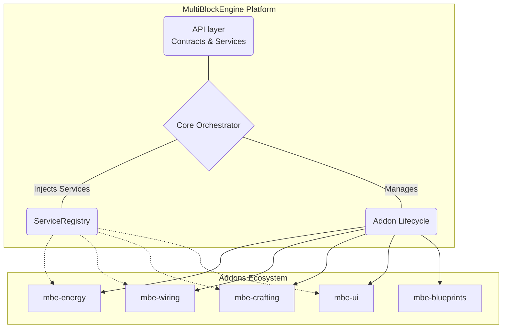

<div align="center">

# ⚙️ MultiBlockEngine (MBE)

*A high-performance, modular, and service-oriented ecosystem for multi-block structures in Minecraft.*

[](https://papermc.io/)
[](#)
[](https://github.com/Parallax-Development/MultiBlockEngine/blob/main/LICENSE)

</div>

---

## 🚀 Overview

**MultiBlockEngine (MBE)** is not just a plugin for detecting custom structures; it's a comprehensive **runtime ecosystem**. Multi-blocks in MBE are living entities with robust state management, behaviors, and deep integrations with customized energy networks, UI systems, and wiring.

Built with an **API-First Design**, extreme modularity via Addons, and a Service-Oriented Architecture (SOA), MBE acts as a solid, unopinionated platform for driving complex gameplay mechanics on your server.

---

## ✨ Features

- **Event-Driven Detection**: No costly periodic world scans. Structures are assembled organically using smart, event-based `AssemblyTrigger`s.
- **Declarative YAML Definitions**: Easily define multi-block patterns, controllers, constraints, and initial states without touching Java code.
- **Service-Oriented Architecture**: Extreme decoupling. Everything from Persistence to Wiring is an injected `MBEService`.
- **First-Class Addon System**: Addons are core expansion modules, managing their own isolated logic, components, and lifecycles without direct class coupling.
- **Built-in Ecosystem Systems**:
  - ⚡ **Energy**: Full abstractions for producers, consumers, storage modules, and isolated networks.
  - 🔌 **Wiring**: Multi-topological generic graphs to connect elements securely (items, liquids, data, energy).
  - 🖥️ **UI System**: Decoupled, reflection-safe UI rendering with dynamic bindings and zero `InventoryView` versioning headaches across 1.19.4-1.21+.
  - 🛠️ **World Crafting**: Autonomous, chunk-based world crafting simulation and dynamic condition-based recipe execution.
  - 🏗️ **Blueprints & Tooling**: In-game visual `BlockDisplay` previews, blueprint-guided builds, and wrench interactions.
- **Reliable Persistence**: Robust SQLite/MySQL state saving, snapshots, and recovery mechanisms to keep instances safe across restarts.

---

## 🧠 Architectural Philosophy

> "The engine does not just search for structures; it builds an ecosystem for them to thrive in."

MBE is structurally divided to avoid tight coupling:

1. **API (`api/`)**: The source of truth. Contains interfaces, domain models, and service contracts. Nothing concrete lives here.
2. **Core (`core/`)**: The inner orchestration layer. Handles service registries, the addon lifecycle, cataloging, and YAML compilation.
3. **Addons (`addons/`)**: Where the actual gameplay features, tooling, and integrations live.

> [!WARNING]
> We enforce strict boundaries. No monolithic God Classes. No hardcoded logic in events. MBE relies purely on event-driven flows and Domain-Driven Design (DDD).

---

## 🏗️ Architecture Diagram



---

## 🔧 Sub-System Highlights

| System | Capabilities | Example Use Case |
| :--- | :--- | :--- |
| **Wiring & Topology** | Generic multi-graph topologies preventing mixed network collisions while maintaining spatial constraints. | Running isolated Item logistics pipelines vs. Energy cables in the same room. |
| **World Crafting** | Chunk-based scanners that evaluate world conditions (temperature, nearby blocks) to autonomously process recipes in-world. | A Blast Furnace that operates autonomously based on nearby lava, tracked by a real-time UI. |
| **Blueprints & Previews** | Interactive placement previews. Allows players to see holograms (`BlockDisplay`) of multi-blocks before confirming placement. | Guided, error-free construction of massive multiblock factories. |
| **Persistence** | Snapshotting and metrics with complete state recovery. Handles chunk-loads asynchronously. | Safely recovering a 500-instance server economy after a crash, without data loss. |

---

## 🧱 Example: YAML Structure Definition

Structures are defined via rich configurations inside `plugins/MultiBlockEngine/multiblocks/`:

```yaml
id: simple_furnace
version: "1.0.0"

# The anchor block that triggers detection
controller: BLAST_FURNACE

pattern:
  - offset: [0, -1, 0]
    match: MAGMA_BLOCK
  - offset: [1, 0, 0]
    match: "#minecraft:stone_bricks"  # Native Tag Support!
```

---

## 💡 Developer Guidelines (Definition of Done)

When building addons or modifying the core, adherence to the strict design rules is required:
- **Contract Isolation**: Keep implementation details strictly out of the `api` layer.
- **Decoupled Services**: Use `@InjectService` instead of rigid singletons or direct coupling.
- **No Circular Dependencies**: Ensure Addons communicate exclusively through events and standard `MBEServices`.
- **Reflection Safety**: Always use compat wrappers (like `InventoryCompatService`) to ensure smooth native cross-version support (1.19.4–1.21+).
- **Non-Blocking operations**: Block updates and persistence MUST be thread-safe or properly scheduled away from the main thread lock-ups.

---

## 📚 Acknowledgements

Built with passion for next-level Minecraft server engineering. Thanks to the open-source projects making this possible:

- [PaperMC](https://papermc.io/) - High-performance Minecraft server software.
- [HikariCP](https://github.com/brettwooldridge/HikariCP) - "Zero-overhead" JDBC connection pool.
- [ProtocolLib](https://github.com/dmulloy2/ProtocolLib) - Protocol manipulation library.
