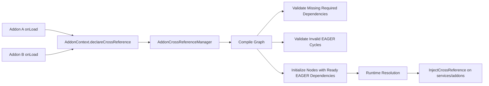
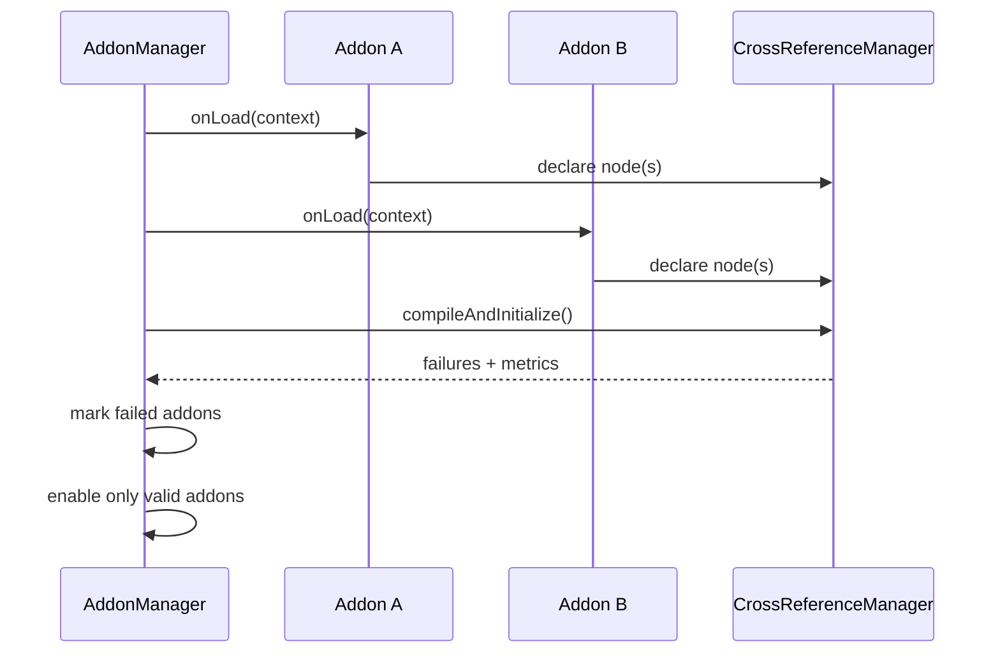

# MultiBlockEngine

**MultiBlockEngine** is a high-performance, extensible, and maintainable multi-block structure system designed for Minecraft servers (Paper/Spigot).

---

## 🎯 Key Objectives

- **Event-Driven Detection**: Detects structures based on events rather than periodic scans.
- **YAML Definitions**: Define multi-block structures using external YAML files.
- **Immutable Models**: Compiles definitions into an internal immutable model for thread safety and performance.
- **Efficient Lifecycle**: Creates live instances only when valid and maintains state with fast invalidation.
- **Separation of Concerns**: Strict separation between definition, instance, and behavior.

---

## 🧠 Design Philosophy

> "The plugin does not search for structures; it recognizes them when they are born and maintains them while they exist."

**Core Principles:**
- **Immutability**: Definitions cannot be changed at runtime, ensuring stability.
- **Early Validation**: Fail fast during parsing to prevent runtime errors.
- **Lightweight Runtime**: Minimal overhead during gameplay.
- **Extensibility**: Designed to grow without breaking existing implementations.

---

## 🧱 Configuration (YAML)

Structures are defined in `plugins/MultiBlockEngine/multiblocks/`.

### Basic Example

```yaml
id: simple_core
version: 1.0

# The anchor block that triggers detection
controller: DIAMOND_BLOCK

pattern:
  # Relative offsets from the controller (x, y, z)
  - offset: [0, -1, 0]
    match: OBSIDIAN
  
  - offset: [1, 0, 0]
    match: "#logs"  # Minecraft Tag support

```

### Matcher Types

The engine compiles YAML patterns into efficient `BlockMatcher` instances:

- **Exact Material**: Matches a specific `Material`.
- **Tag Matcher**: Matches a block tag (e.g., `#logs`, `#wool`).
- **AnyOf**: Matches any from a list of matchers.
- **Air**: Explicitly matches air blocks.

---

## 🏗️ Project Structure

The codebase follows a modular architecture:

```text
src/main/java
└─ com.darkbladedev.engine
   ├─ api
   │  └─ event
   │     ├─ MultiblockFormEvent.java     # Cancellable creation event
   │     ├─ MultiblockBreakEvent.java    # Cancellable destruction event
   │     └─ MultiblockInteractEvent.java # Interaction handling
   ├─ command
   │  └─ MultiblockCommand.java          # /mb command (Inspect, Reload, Status)
   ├─ listener
   │  └─ MultiblockListener.java         # Core event handling (Place/Break/Interact)
   ├─ manager
   │  ├─ MultiblockManager.java          # State, Ticking & Logic controller
   │  └─ MetricsManager.java             # Performance tracking
   ├─ model
   │  ├─ MultiblockType.java             # Immutable definition
   │  ├─ MultiblockInstance.java         # Live structure instance
   │  ├─ MultiblockState.java            # Enum: ACTIVE, DISABLED, etc.
   │  ├─ PatternEntry.java               # Relative pattern rule
   │  ├─ action
   │  │  ├─ Action.java                  # Action interface
   │  │  ├─ SendMessageAction.java
   │  │  ├─ ConsoleCommandAction.java
   │  │  └─ SetStateAction.java
   │  └─ matcher
   │     ├─ BlockMatcher.java            # Functional interface
   │     ├─ ExactMaterialMatcher.java
   │     ├─ TagMatcher.java
   │     ├─ BlockDataMatcher.java        # State matching (stairs, slabs)
   │     └─ ...
   ├─ parser
   │  └─ MultiblockParser.java           # YAML to Object compiler
   └─ storage
      ├─ StorageManager.java             # Persistence interface
      └─ SqlStorage.java                 # SQLite implementation (w/ Migrations)
```

---

## ⚙️ Execution Flow

1.  **Startup**:
    - Load YAML definitions.
    - Validate and compile into `MultiblockType`.
    - Restore persisted instances from database.
2.  **Runtime**:
    - Listen for `BlockPlaceEvent` and `PlayerInteractEvent`.
    - Check if the block is a known **Controller**.
    - Validate the surrounding pattern candidates.
    - If valid, create and register a `MultiblockInstance`.
3.  **Invalidation**:
    - Listen for `BlockBreakEvent`.
    - Check if the block belongs to an active instance (O(1) lookup).
    - Destroy the instance and clean up resources.

---

## 💾 Persistence

- **State Management**: Active instances are tracked in memory for fast access.
- **Shutdown**: Instances are serialized and saved to the database (SQLite via HikariCP).
- **Startup**: Instances are restored and lazily re-validated.

---

## 🚀 Future Development Plan

The following features are planned for future releases:

1.  **Phase 1: Advanced Matching**
    - [x] `BlockState` support (e.g., stairs, slabs).
    - [x] NBT/Component data matching.

2.  **Phase 2: Condition & Action systems**
    - [x] Implement a flexible conditions system for multiblock behavior.
    - [x] Add actions to be performed when a structure is valid (e.g., trigger events, run commands).

3.  **Phase 3: Rotation & Symmetry**
    - [x] Support for 4-direction horizontal rotation.
    - [x] Automatic pattern adjustment based on controller facing.

4.  **Phase 4: Multiblock States**
    - [x] Multiblock states (e.g., ACTIVE, DAMAGED, DISABLED, OVERLOADED)

5.  **Phase 5: Dynamic topology (grow/shrink, mutation)**
    - [x] Dynamic structures (optional blocks).
    - [x] Multi-chunk structure support (Chunk Safety).

6.  **Phase 6: Basic Debugging Tools**
    - [x] Add a debug command to inspect multiblock instances.
    - [x] Add particle effects for validating patterns.

7.  **Phase 7: Advanced Runtime Scaling**
    - [x] Cache frequently accessed data (e.g., compiled matchers).
    - [x] Batch processing for large-scale operations.
    - [x] Memory-efficient data structures.
    - [x] Adaptive ticking: priority by player distance, sleep when inactive

8.  **Phase 8: API & Integration**
    - [x] Developer API for custom behaviors.
    - [x] Integration with protection plugins (WorldGuard, GriefPrevention) - *Via Events*.

9.  **Phase 9: Advanced Debugging & Monitoring**
    - [x] Add debug mode with verbose logging.
    - [x] Implement a metrics system (e.g., Prometheus) for performance tracking.

10.  **Phase 10: Migration & Compatibility**
      - [x] Versioning of multiblock definitions.
      - [x] Automated migrator for existing structures.
      - [x] Clear warnings for incompatible changes.

---

## 📚 References

- [PaperMC](https://papermc.io/) - High performance Minecraft server software.
- [HikariCP](https://github.com/brettwooldridge/HikariCP) - A "zero-overhead" production ready JDBC connection pool.
- [PlaceholderAPI](https://github.com/PlaceholderAPI/PlaceholderAPI) - Placeholder expansion for Bukkit plugins.

---

## 🔁 Addon Cross-Reference System

The addon runtime now includes a dedicated cross-reference graph with dynamic resolution, lazy edges, and cycle validation before addon enable.

### Core API

- `CrossReferenceDeclaration<T>`: Declarative node definition (`referenceId`, `contractType`, factory, dependencies).
- `CrossReferenceDependency`: Dependency edge with `required` + `mode` (`EAGER` or `LAZY`).
- `CrossReferenceHandle<T>`: Late-bound handle used to break hard coupling between addons/classes.
- `InjectCrossReference`: Field injection annotation for direct or handle-based cross-reference access.
- `AddonContext` extensions:
  - `declareCrossReference(...)`
  - `getCrossReference(...)`
  - `getCrossReferenceHandle(...)`
  - `getCrossReferenceMetrics()`

### Architecture Diagram



### Validation Model

- Required missing dependency: compilation failure for the owner addon.
- EAGER cycle (A↔B or self-loop): invalid, compilation failure.
- LAZY cycle: valid, resolved through handles without classloader-level hard coupling.
- Factory type mismatch/null return: initialization failure and addon marked as failed.

### Load Lifecycle



### Usage Example

```java
public final class EnergyAddon implements MultiblockAddon {
    private AddonContext context;

    @Override
    public String getId() {
        return "energy";
    }

    @Override
    public String getVersion() {
        return "1.0.0";
    }

    @Override
    public void onLoad(AddonContext context) {
        this.context = context;
        context.declareCrossReference(
            CrossReferenceDeclaration.builder("energy:grid", EnergyGridApi.class, resolver -> new EnergyGridService(
                resolver.handle("machines:controller", MachineControllerApi.class)
            ))
                .dependsOnRequiredLazy("machines:controller")
                .build()
        );
    }

    @Override
    public void onEnable() {
        EnergyGridApi grid = context.getCrossReference("energy:grid", EnergyGridApi.class).orElseThrow();
        grid.start();
    }

    @Override
    public void onDisable() {
    }
}
```

### Injection Example

```java
public final class MachineService implements MBEService {
    @InjectCrossReference("energy:grid")
    private CrossReferenceHandle<EnergyGridApi> energyGrid;

    @Override
    public String getServiceId() {
        return "machines:service";
    }

    @Override
    public void onEnable() {
        energyGrid.resolve().ifPresent(EnergyGridApi::warmup);
    }
}
```

### Performance Metrics

The runtime reports:

- Declared references
- Initialized references
- Failed references
- Compile time (ns/ms)
- Initialization time (ns/ms)
- Total graph build cost

Current implementation is validated with tests that compile and initialize 1000 declarations under a bounded runtime budget, ensuring no significant startup degradation under typical addon counts.

### Migration Guide for Addon Developers

- Keep existing `@InjectService` usage unchanged for service DI.
- Introduce cross-addon class coupling through `CrossReferenceDeclaration` instead of direct class imports between addon jars.
- Replace hard direct links with `CrossReferenceHandle<T>` when both sides need bidirectional integration.
- Use `dependsOnRequiredEager(...)` only when strict initialization order is necessary.
- Use `dependsOnRequiredLazy(...)` for bidirectional or deferred-runtime linking.
- Query metrics through `AddonContext.getCrossReferenceMetrics()` for startup diagnostics.
- Backward compatibility: addons that do not use cross-reference API continue to work without changes.

### Legacy Compatibility Notes

- Existing addon service lifecycle (`registerService`, `getService`, `@InjectService`) remains intact.
- New cross-reference injection is additive and optional.
- Addon load/enable order still respects addon-level dependency resolver.
